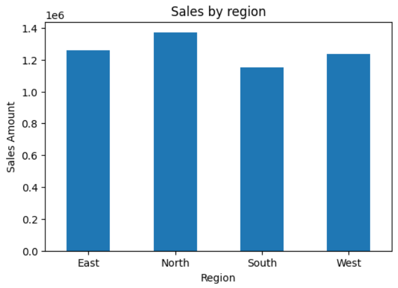
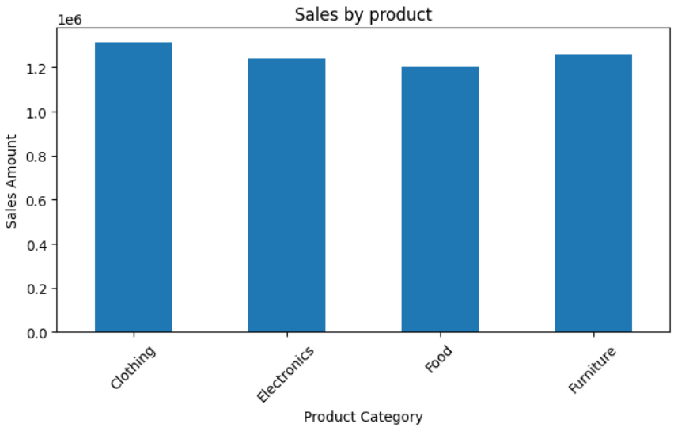
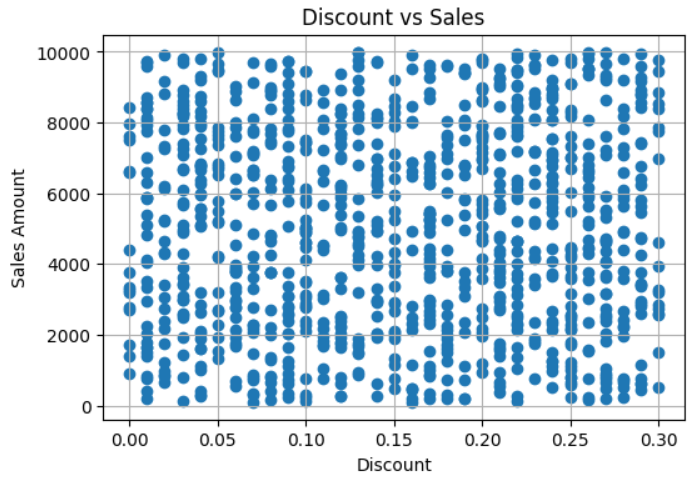

# Retail Sales Data Analysis using Python
Retail Sales Data Analysis using Python, Pandas, Matplotlib and Seaborn

## Objective
Analyze retail sales data to identify sales trends, top-performing categories, regional performance, and business insights using Python.

## Project Overview

This project analyzes retail sales data using Python to identify trends, top-performing regions, and customer purchase patterns.

## Tools Used

* Python
* Pandas
* NumPy
* Matplotlib
* Seaborn
* Google Colab

## Visualizations

### Sales by Region

### Sales by Product Category

### Monthly Sales Trend
.png)

### Discount vs Sales

## Key Insights

* North region generated highest revenue
* Clothing was the top-selling category
* Sales peaked in January
* Retail channel slightly outperformed online sales

## Project Workflow

1. Data Collection
2. Data Cleaning
3. Exploratory Data Analysis (EDA)
4. Visualization
5. Business Insights
